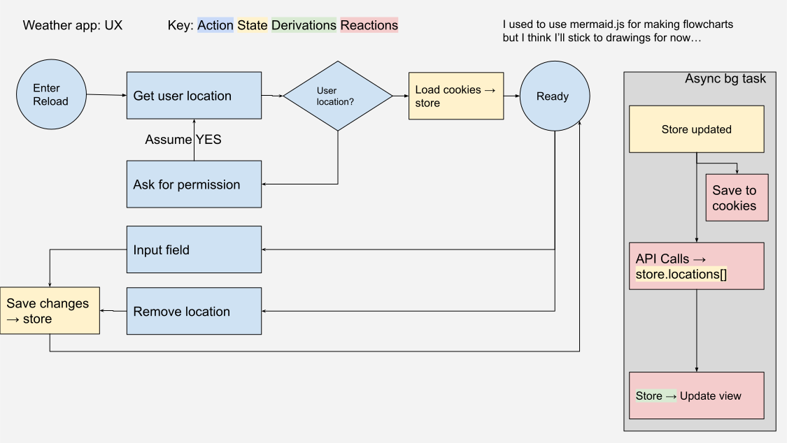

# Notes

Ideas for the overall design of the app e.g where should data be stored; what should be actions/observers?

## Data in terms of MobX

### State (data types)

- Each widget should have it's own type derived from each location view
- Each location should have the complete data for all the different widgets in it
- A list of locations to show data for --> save into cookies each time there is a change
- View = mobile | desktop format

### Actions (by the user?)

- Update preferences on locations
- View changes from desktop to mobile or vise versa
- Search bar (or input field?) --> adds to list of locations, performs API call
- Reloads page --> load from cookies --> makes api call for each location saved

### Observables (Things user can see)

- Location cards one for each location that exists? contains widgets.
- Widgets

## Data Flow UX

I'm quite inexperienced in UX but I like to make flow diagrams.

Found in [docs/weather-app-ux-design](./docs/../weather-app-ux-design.svg):

## Types and models

- `latlon`: contains lat and lon keys with number values
- `local-weather`: weather given by the API with the specific `latlon` query
- `locations`: an map of `latlon`'s to `local-weather`
- `location-order`: an array of `latlon`'s in the order the user wants

Perhaps `latlon` can be incorporated into another type which has location information like City/State