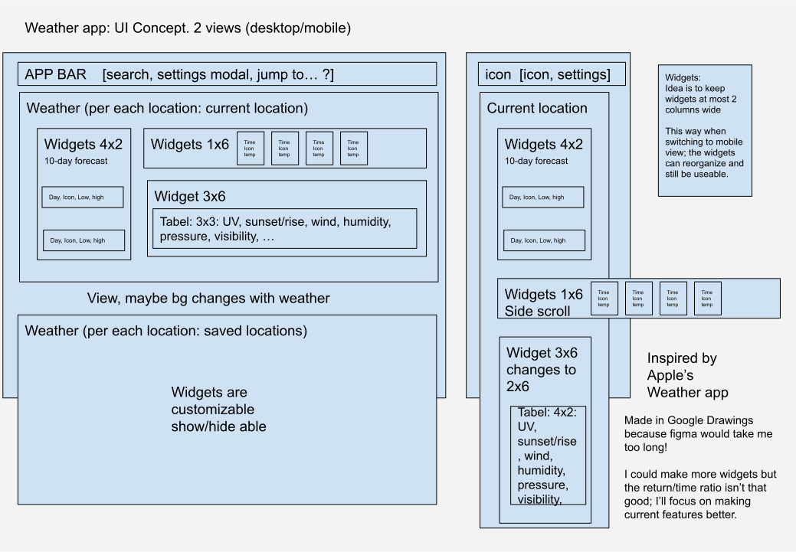

# Progress Chart

To keep track of the time it took for me to do each goal.
Also as notes for what changes I did throughout this project, all steps taken.

Table of contents

- [Day 1: Monday (Base App)](#day-1-monday-base-app)
  - [Goal1: 30min: Set up the app; create all source dirs and files; Write some MDs; Run app.](#goal1-30min-set-up-the-app-create-all-source-dirs-and-files-write-some-mds-run-app)
  - [Goal: 15min: Checkout API](#goal-15min-checkout-api)
  - [Goal: 30min: Preliminary UI Design](#goal-30min-preliminary-ui-design)
- [Day 2: Tuesday (Base App)](#day-2-tuesday-base-app)
  - [Goal: something Time: something-something](#goal-something-time-something-something)
  - [Goal: something Time: something-something](#goal-something-time-something-something-1)
- [Day 3: Wednesday (Style)](#day-3-wednesday-style)
  - [Goal: something Time: something-something](#goal-something-time-something-something-2)
  - [Goal: something Time: something-something](#goal-something-time-something-something-3)
- [Day 4: Thursday (Testing)](#day-4-thursday-testing)
  - [Goal: something Time: something-something](#goal-something-time-something-something-4)
  - [Goal: something Time: something-something](#goal-something-time-something-something-5)
- [Day 5: Friday (Extra!)](#day-5-friday-extra)
  - [Goal: something Time: something-something](#goal-something-time-something-something-6)
  - [Goal: something Time: something-something](#goal-something-time-something-something-7)

## Day 1: Monday (Base App)

### Goal1: 30min: Set up the app; create all source dirs and files; Write some MDs; Run app.
- `npx create-react-app tmd-tech-challenge`
- `npm install mobx mobx-react axios react-router-dom`
- `npm install --save typescript @types/node @types/react @types/react-dom @types/jest @types/react-router-dom`
- Add [tsconfig.json](./tsconfig.json)
- Remove old src files `rm index.css index.js App.js App.css App.test.js logo.svg reportWebVitals.js setupTests.js`
- Add new src files `mkdir apis components models pages stores types && touch app-context.ts app.tsx index.tsx`
- Write initial [index](src/index.tsx), [app](./src/app.tsx), [app-context](./src/app-context.ts)

### Goal: 15min: Checkout API
- Make an account on [openweathermap.org](https://openweathermap.org/api)
- Skim though api data and docs; using [One Call Api 3.0](https://openweathermap.org/api/one-call-3)
  - It's not too bad; actually it's quite nice. I can parse most of the data in JS; very simple to use API! But how to use the data.

Now that I know the API I can think about what UI I can use to show this data!
I can take a long time to work a design; but I want to focus more on the React than the styling, so I'll make a simple UI first.
If there is time I'll make the UI more interesting

### Goal: 30min: Preliminary UI Design
- Sketched out a design in Google Drawings:
- Found in [docs/weather-app-ui-design](./docs/../weather-app-ui-design.svg):
- I added some notes on how I want the UI in the sketch.

## Day 2: Tuesday (Base App)

Goals:
- Something

### Goal: something Time: something-something

### Goal: something Time: something-something

## Day 3: Wednesday (Style)

Goals:
- Something

### Goal: something Time: something-something

### Goal: something Time: something-something

## Day 4: Thursday (Testing)

Goals:
- Something

### Goal: something Time: something-something

### Goal: something Time: something-something

## Day 5: Friday (Extra!)

Goals:
- Something

### Goal: something Time: something-something

### Goal: something Time: something-something
