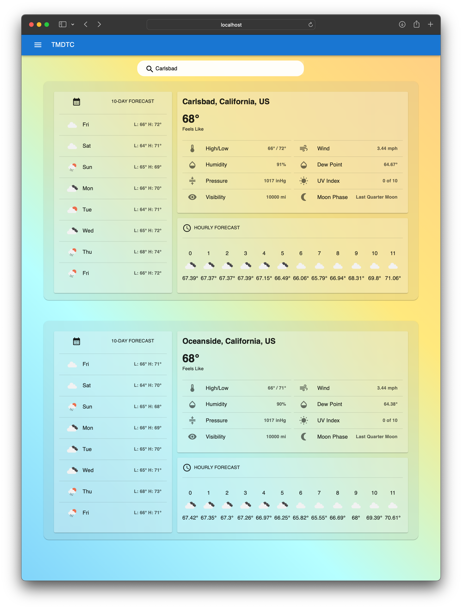
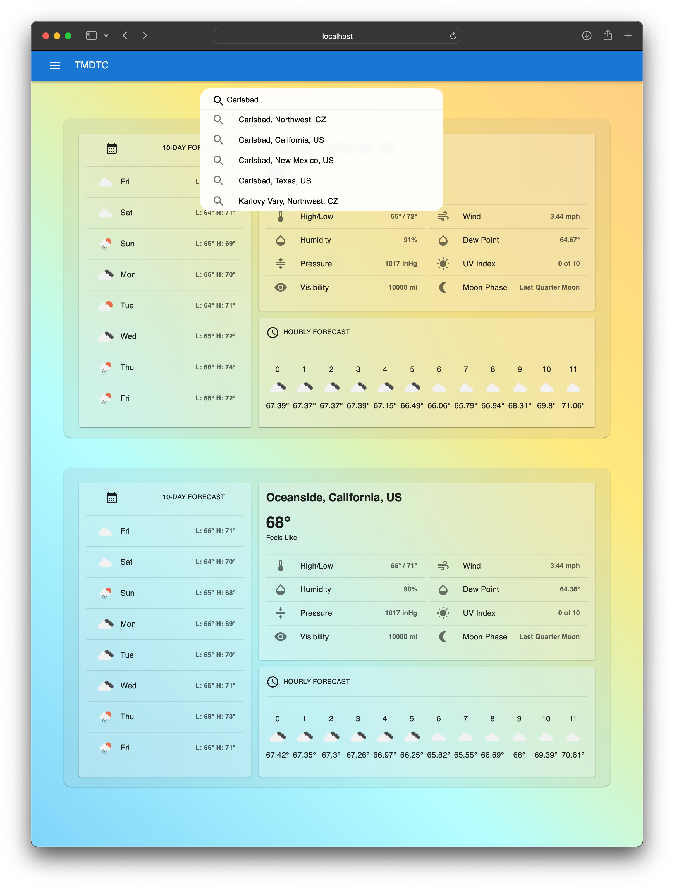

# Progress Chart

To keep track of the time it took for me to do each goal.
Also as notes for what changes I did throughout this project, all steps taken.

Table of contents

- [Day 1: Monday (Base App)](#day-1-monday-base-app)
  - [Set up the app; Docs; Run app.](#set-up-the-app-docs-run-app)
  - [Checkout API](#checkout-api)
  - [Preliminary UI Design](#preliminary-ui-design)
  - [Preliminary UX Design](#preliminary-ux-design)
  - [Implement Types and Models](#implement-types-and-models)
  - [Implement Stores and Api calls](#implement-stores-and-api-calls)
  - [Implement Express backend server](#implement-express-backend-server)
- [Day 2: Tuesday (Base App)](#day-2-tuesday-base-app)
  - [Test Api and Store's update](#test-api-and-stores-update)
  - [Add Support for Geolocation: City names API](#add-support-for-geolocation-city-names-api)
  - [Geolocation and Cookies Logic](#geolocation-and-cookies-logic)
  - [Bare Bones Components Outlines](#bare-bones-components-outlines)
- [Day 3: Wednesday (Style, UI)](#day-3-wednesday-style-ui)
  - [Style Components and populate them with data](#style-components-and-populate-them-with-data)
  - [User Input Features 330](#user-input-features-330)
  - [Actually Searching and Adding to the list](#actually-searching-and-adding-to-the-list)
- [Day 4: Thursday (Testing and finishing up some other work...)](#day-4-thursday-testing-and-finishing-up-some-other-work)
  - [Revisit Cookies](#revisit-cookies)
  - [Auto Populate with Geolocation](#auto-populate-with-geolocation)
  - [Add MetaData editing](#add-metadata-editing)
  - [Adapt for two views](#adapt-for-two-views)
  - [Learn and Implement Jest (only if there is time)](#learn-and-implement-jest-only-if-there-is-time)
- [Day 5: Friday (Extra!)](#day-5-friday-extra)
  - [Actually I don't think I'll work on this on Friday. I have plans.](#actually-i-dont-think-ill-work-on-this-on-friday-i-have-plans)

## Day 1: Monday (Base App)
**Roughly 5 hours**

- I realized I spent so much time on really small issues and bugs that are a low priority.
- I got stuck making the extra backend-express server to hide the key.
- I also got stuck with some limitations of javascript, equality operators not being override-able; resulting in a bad Map.
- I was making really great progress at the start of the day but by the end of it I slowed down.

### Set up the app; Docs; Run app.
**30 minutes**
- `npx create-react-app tmd-tech-challenge`
- `npm install mobx mobx-react axios react-router-dom`
- `npm install --save typescript @types/node @types/react @types/react-dom @types/jest @types/react-router-dom`
- Add [tsconfig.json](./tsconfig.json)
- Remove old src files `rm index.css index.js App.js App.css App.test.js logo.svg reportWebVitals.js setupTests.js`
- Add new src files `mkdir apis components models pages stores types && touch app-context.ts app.tsx index.tsx`
- Write initial [index](src/index.tsx), [app](./src/app.tsx), [app-context](./src/app-context.ts)

### Checkout API
**15 minutes**
- Make an account on [openweathermap.org](https://openweathermap.org/api)
- Skim though api data and docs; using [One Call Api 3.0](https://openweathermap.org/api/one-call-3)
  - It's not too bad; actually it's quite nice. I can parse most of the data in JS; very simple to use API! But how to use the data.

Now that I know the API I can think about what UI I can use to show this data!
I can take a long time to work a design; but I want to focus more on the React than the styling, so I'll make a simple UI first.
If there is time I'll make the UI more interesting

### Preliminary UI Design
**30 Minutes**
- Sketched out a UI design in Google Drawings:
- Found in [docs/weather-app-ui-design](./docs/../weather-app-ui-design.svg):
- I added some notes on how I want the UI in the sketch.

### Preliminary UX Design
**30 Minutes**
- Sketched out a UX design in Google Drawings:
- Found in [docs/weather-app-ux-design](./docs/../weather-app-ux-design.svg):

### Implement Types and Models
**45 Minutes**
- Created Types: `touch latlon.ts local-weather.ts` in [types](../src/types/)
- Created Models: `touch latlon.ts local-weather.ts` in [models](../src/models/)
- Took longer than I expected; still very new to how to make proper maintainable organization of types and data.
- I should really implement some tests to test end-to-end of this app.

### Implement Stores and Api calls
**45 Minutes**
- Since this app is small there may only be a need for 1 store. The whole page will update at once; not in parts.
- Changed models to use objects as arguments; easier to pass into it. Not sure if this is good practice though.
- Needed to find a way to store the API key secretly; It should be on the server, not put into the client.
  - Looks like this is not possible with React clients (when built) a backend server is needed to proxy the request.
  - So I'll set up a quick express server to proxy the backend requests, this server will also serve the client.

### Implement Express backend server
**90 Minutes**
- Installing more packages `npm install cors dotenv express nodemon express-http-proxy`
- Created `touch .env server.js`; modified `package.json` for dev options
- I want to use:
  - `npm run dev` to start a two servers; the frontend and backend, where the backend proxies to the frontend.
  - `npm run start` (after building) to run one server: the backend server which can serve the frontend built.
- That took a long time. I had issues using proxy and etc; Wow backend stuff really took me a while to sort out...
- Going to `localhost:6005/api` is the api page; and using `localhost:6005/api/openweatherapi?params=whatever` will forward
  - the request to the openweatherapi server (by also appending the proper weather api key).
  - This way the key stays on the server and doesn't get built into the client.

## Day 2: Tuesday (Base App)
**Roughly 8 Hours**

- Today felt slower than yesterday; I ran into things that I'm quite new to or inexperienced with.
- I'm not very good at CSS/HTML; so I can follow can create the backend fo the React app but I don't have much experience with how to use things like flexbox or how to enter elements.
- On top of that I ran into some bugs that kept holding me back. Things like not knowing cookies can only be a certain size, and some typing issues with Functional Components.
- Ultimately today felt like it should have been quite easy but it took longer than expected.
- But I do like how much I'm learning about React and making UIs; I just wish I had more experience so I can get to the point where I can start making some real headway and innovations in the design. I really want to get into the optimizations and really have a deep understanding of how everything is working together. I like that feeling.

### Test Api and Store's update
**60 Minutes**
- Rethink how LatLon information is stored.
  - Since Map cannot use an Object as a key then I'll make another "table" to hold key-->LatLon values. That way each LatLon has a unique id. Adding LatLon's will first check this "table"
  - In the future this will help streamline the geolocation features as well.
- Run the API from the app
- Check to make sure the store is updating

### Add Support for Geolocation: City names API
**90 Minutes**
- Add new data type: `IGeolocation`, models: `Geolocation`, api calls to geolocation api.
- Rethink the search API.

### Geolocation and Cookies Logic
**90 Minutes**
- Looks like geolocation isn't too hard to get from the user (as long as they enable it and are on wifi).
- `npm install react-cookie`; Using cookies doesn't seem too bad, I should add validation (since the user can mess with the cookies). Or I could do something fancy and take a hash of the state with some secret haha. I should add error catching to default to a working state...
- Integrate cookies to store the Store.
- I was stuck on this for the majority of the time. :(
  - I think it's because the cookie I'm trying to save is too large, I could save a sessionId and the data in the backend.
  - Or I can just save a limited amount of information in the cookies.
- For now I should skip this section and move on, I'll come back to it later.

### Bare Bones Components Outlines
**4 Hours**
- Make all the components and pass them data
- components: `NavBar`, `WeatherCard`, `WeatherWidget`
- `npm install @mui/material @mui/icons-material @emotion/react @emotion/styled` I like to use MUI React.
- Checkpoint: [basic-components-layout.html](../public/snapshots/basic-components-layout.html)
- I got a little distracted trying to create some layouts; CSS my enemy!
- Built the "10-DAY FORECAST" and started on "HOURLY FORECAST"
- Need to keep working on this tomorrow; this means I didn't finish all my tasks for the day...
- Checkpoint: [components-partly-populated.html](../public/snapshots/components-partly-populated.html)

## Day 3: Wednesday (Style, UI)

### Style Components and populate them with data
**2.5 Hours**
- Ended up working on some styles haha. [tmdtc-frosted-glass.html](../public/snapshots/tmdtc-frosted-glass.html)
- Finished up making components use data. And styled. [tmdtc-components-populated.html](../public/snapshots/tmdtc-components-populated.html)
- ~~Think about C/F settings~~ Most of these can be set in the query parameters, need to keep track of it.

### User Input Features 330
**3 Hours**
- Search bar and suggestions.
- I realized that I was spending too much time trying to make the search work UI wise in the NAV bar, so I'll do something more similar to Google's style
- Ok so I switched the style but I'm still taking a long time. I need to pace myself better and work on the core features: actually searching and loading data.
- What it looks like: [tmdtc-frosted-glass.html](../public/snapshots/tmdtc-frosted-glass.html)

### Actually Searching and Adding to the list
**120 Minutes**
- Making the search bar query and load data to display.
- Search bar can search and display query results; also it looks really nice right now!
- Search uses API to get data; shows loading while searching.
- Loaded weather cards show up automatically.
- I did a lot during this time. It was productive! much more than messing with styles, this means:
  - I need to learn more about styles and well I'm using the MUI Framework so that doesn't help.
  - I need to learn more about different API's that exist. I'm using a lot of crutches and workarounds, this will get better over time.
  - I'm actually enjoying the process but I know it shouldn't be a trial and error process. That's why I want to learn how to do it properly and with the right tools. I don't want this to be a hackathon.
- I'm happy where it is at currently. [tmdtc-search-works.html](../public/snapshots/tmdtc-search-works.html) although this snapshot doesn't have the features to search. The drop down is very nice!
- Screenshots: 
  - 
  - 

## Day 4: Thursday (Testing and finishing up some other work...)

### Revisit Cookies
**90 Minutes**
- Cookies work now; it saves to cookies on each time store changes.
- It reads from cookies when browser opens up.
- There is a bug where reloading too quickly causes the store to only partially update, and each time it does the cookies update. This means that sometimes if the store is not done loading the cookies; some items are lost. I could use a flag or maybe defer loading the UI until after the store is done processing the cookies.
- Unfortunately I had to change a lot of code; but for the better; API is pure now (not relying on store).

### Auto Populate with Geolocation
**60 Minutes**
- This wasn't too hard to get the location but I also took this time to solve some bugs namely the one I mentioned previously.
- I realized I had created race conditions and wasn't really using mobx properly with awaits/async on API calls.
- Futhermore I ran into an issue where using LatLon isn't a good idea for IDs because: somebody in the same location could
  - have a slightly different LatLon, which causes the program to think this is a new location.

### Add MetaData editing
- Remove an item
- Clear all items from the list
- Save (autosave) to cookies button (or toggle?)
- Move an item up or down in the list (only if there is time)
- Toggle save on certain locations (default on or off?) (only if there is time)

### Adapt for two views

### Learn and Implement Jest (only if there is time)

## Day 5: Friday (Extra!)

### Actually I don't think I'll work on this on Friday. I have plans.

But that being said if I had more time I know what I would work on.
