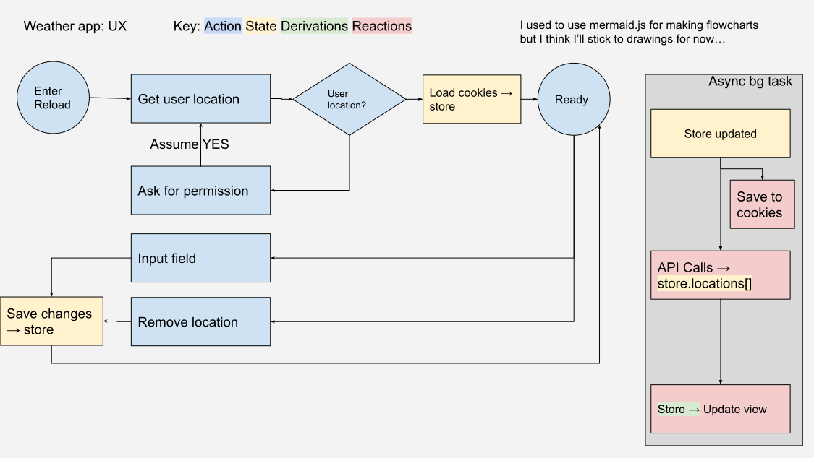

# Progress Chart

To keep track of the time it took for me to do each goal.
Also as notes for what changes I did throughout this project, all steps taken.

Table of contents

- [Day 1: Monday (Base App)](#day-1-monday-base-app)
  - [Set up the app; Docs; Run app.](#set-up-the-app-docs-run-app)
  - [Checkout API](#checkout-api)
  - [Preliminary UI Design](#preliminary-ui-design)
  - [Preliminary UX Design](#preliminary-ux-design)
  - [Implement Types and Models](#implement-types-and-models)
  - [Implement Stores and Api calls](#implement-stores-and-api-calls)
  - [Implement Express backend server](#implement-express-backend-server)
- [Day 2: Tuesday (Base App)](#day-2-tuesday-base-app)
  - [Test Api and Store's update](#test-api-and-stores-update)
  - [Add Support for Geolocation: City names API](#add-support-for-geolocation-city-names-api)
  - [Cookies Logic](#cookies-logic)
  - [Bare Bones Components outlines](#bare-bones-components-outlines)
- [Day 3: Wednesday (Style)](#day-3-wednesday-style)
  - [Make all the components functional and display properly](#make-all-the-components-functional-and-display-properly)
- [Day 4: Thursday (Testing)](#day-4-thursday-testing)
  - [Learn and Implement Jest](#learn-and-implement-jest)
- [Day 5: Friday (Extra!)](#day-5-friday-extra)
  - [Actually I don't think I'll work on this on Friday](#actually-i-dont-think-ill-work-on-this-on-friday)

## Day 1: Monday (Base App)
**Roughly 5 hours**

I realized I spent so much time on really small issues and bugs that are a low priority.
I got stuck making the extra backend-express server to hide the key.
I also got stuck with some limitations of javascript, equality operators not being override-able; resulting in a bad Map.
I was making really great progress at the start of the day but by the end of it I slowed down.

### Set up the app; Docs; Run app.
**30 minutes**
- `npx create-react-app tmd-tech-challenge`
- `npm install mobx mobx-react axios react-router-dom`
- `npm install --save typescript @types/node @types/react @types/react-dom @types/jest @types/react-router-dom`
- Add [tsconfig.json](./tsconfig.json)
- Remove old src files `rm index.css index.js App.js App.css App.test.js logo.svg reportWebVitals.js setupTests.js`
- Add new src files `mkdir apis components models pages stores types && touch app-context.ts app.tsx index.tsx`
- Write initial [index](src/index.tsx), [app](./src/app.tsx), [app-context](./src/app-context.ts)

### Checkout API
**15 minutes**
- Make an account on [openweathermap.org](https://openweathermap.org/api)
- Skim though api data and docs; using [One Call Api 3.0](https://openweathermap.org/api/one-call-3)
  - It's not too bad; actually it's quite nice. I can parse most of the data in JS; very simple to use API! But how to use the data.

Now that I know the API I can think about what UI I can use to show this data!
I can take a long time to work a design; but I want to focus more on the React than the styling, so I'll make a simple UI first.
If there is time I'll make the UI more interesting

### Preliminary UI Design
**30 Minutes**
- Sketched out a UI design in Google Drawings:
- Found in [docs/weather-app-ui-design](./docs/../weather-app-ui-design.svg):
- I added some notes on how I want the UI in the sketch.

### Preliminary UX Design
**30 Minutes**
- Sketched out a UX design in Google Drawings:
- Found in [docs/weather-app-ux-design](./docs/../weather-app-ux-design.svg):

### Implement Types and Models
**45 Minutes**
- Created Types: `touch latlon.ts local-weather.ts` in [types](../src/types/)
- Created Models: `touch latlon.ts local-weather.ts` in [models](../src/models/)
- Took longer than I expected; still very new to how to make proper maintainable organization of types and data.
- I should really implement some tests to test end-to-end of this app.

### Implement Stores and Api calls
**45 Minutes**
- Since this app is small there may only be a need for 1 store. The whole page will update at once; not in parts.
- Changed models to use objects as arguments; easier to pass into it. Not sure if this is good practice though.
- Needed to find a way to store the API key secretly; It should be on the server, not put into the client.
  - Looks like this is not possible with React clients (when built) a backend server is needed to proxy the request.
  - So I'll set up a quick express server to proxy the backend requests, this server will also serve the client.

### Implement Express backend server
**90 Minutes**
- Installing more packages `npm install cors dotenv express nodemon express-http-proxy`
- Created `touch .env server.js`; modified `package.json` for dev options
- I want to use:
  - `npm run dev` to start a two servers; the frontend and backend, where the backend proxies to the frontend.
  - `npm run start` (after building) to run one server: the backend server which can serve the frontend built.
- That took a long time. I had issues using proxy and etc; Wow backend stuff really took me a while to sort out...
- Going to `localhost:6005/api` is the api page; and using `localhost:6005/api/openweatherapi?params=whatever` will forward
  - the request to the openweatherapi server (by also appending the proper weather api key).
  - This way the key stays on the server and doesn't get built into the client.

## Day 2: Tuesday (Base App)

### Test Api and Store's update
**60 Minutes**
- Rethink how LatLon information is stored.
  - Since Map cannot use an Object as a key then I'll make another "table" to hold key-->LatLon values. That way each LatLon has a unique id. Adding LatLon's will first check this "table"
  - In the future this will help streamline the geolocation features as well.
- Run the API from the app
- Check to make sure the store is updating

### Add Support for Geolocation: City names API
**90 Minutes**
- Add new data type: `IGeolocation`, models: `Geolocation`, api calls to geolocation api
- Rethink the search API

### Cookies Logic

### Bare Bones Components outlines
- Think about C/F settings

## Day 3: Wednesday (Style)

### Make all the components functional and display properly

## Day 4: Thursday (Testing)

### Learn and Implement Jest

## Day 5: Friday (Extra!)

### Actually I don't think I'll work on this on Friday